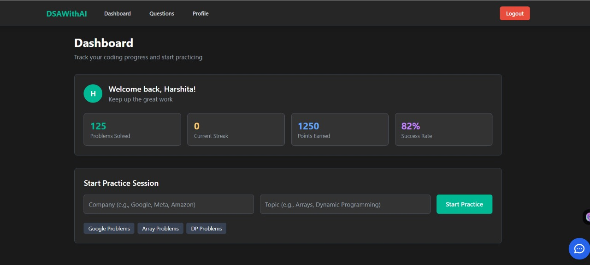
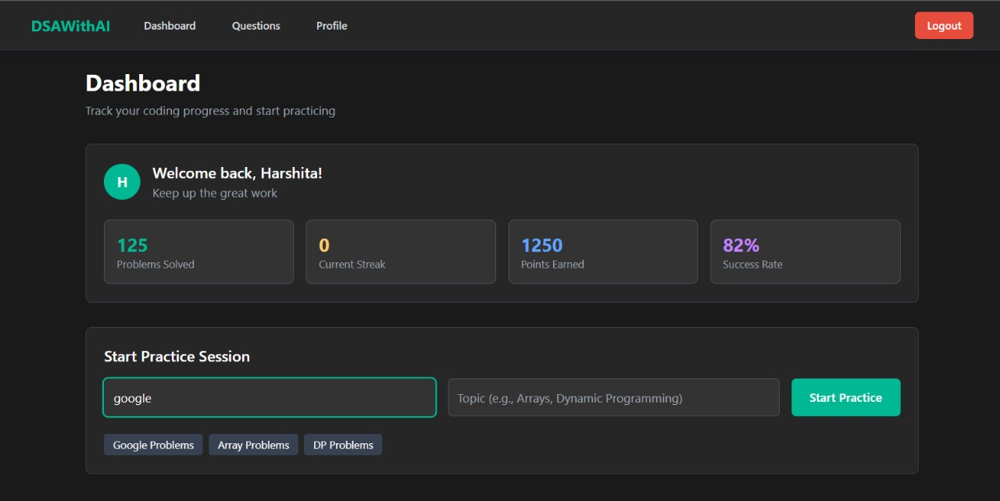
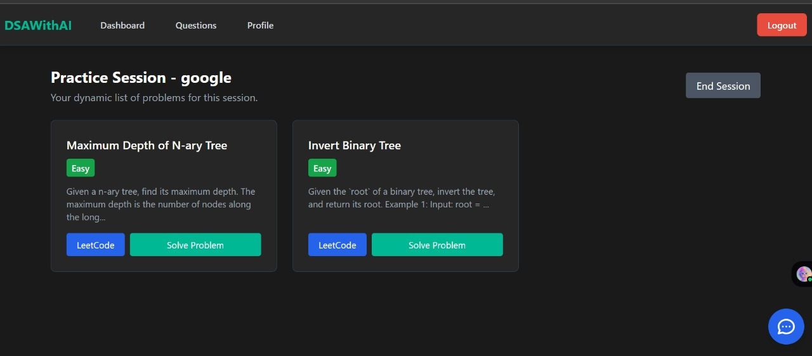
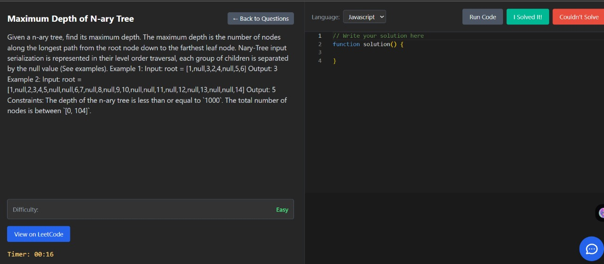
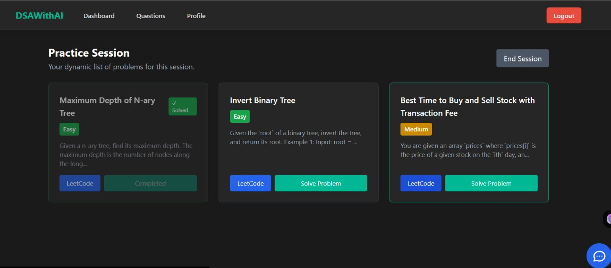
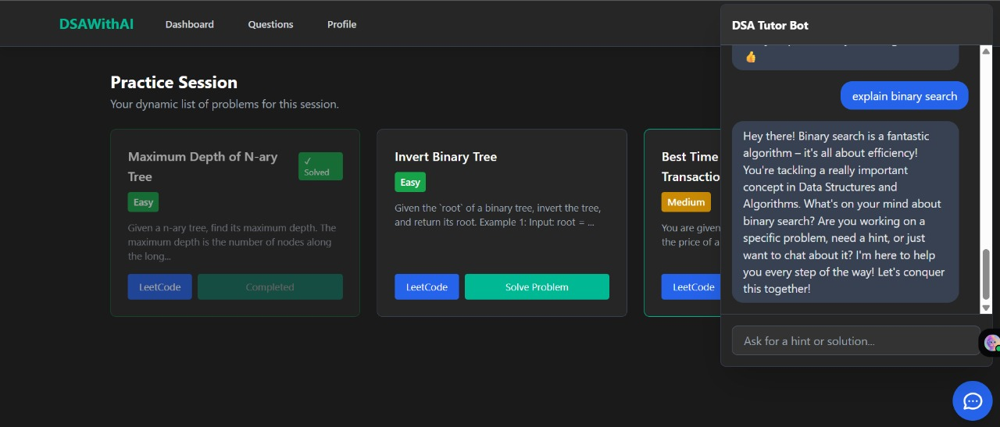
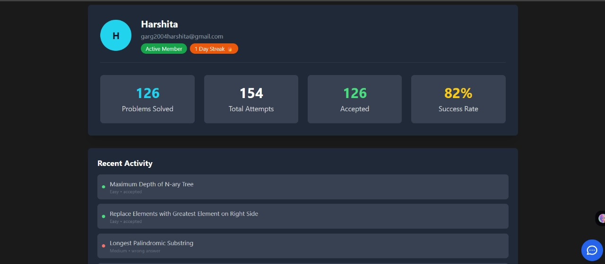
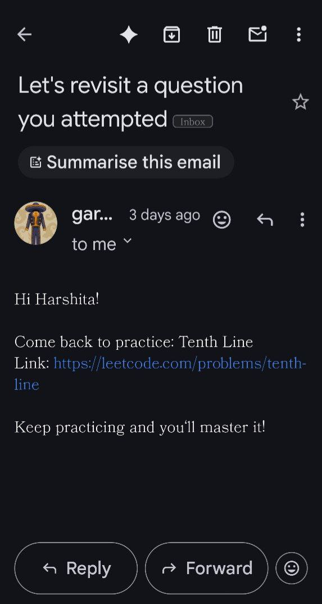

# Adaptive DSA Practice & AI Tutoring Platform

A full‑stack platform for coding interview preparation that *adapts* problem difficulty, provides an in‑browser multi-language editor with remote execution, and offers on-demand AI hints/explanations.

## Key Features
- **Adaptive Recommendation**
- **AI Tutor (Gemini)**
- **Real-Time Code Execution**
- **Progress Analytics**
- **Session Persistence**
- **Extensible Architecture**

## Architecture Overview
| Layer      | Tech / Tools |
|------------|--------------|
| Frontend   | React, Vite, Axios, Tailwind-esque utilities |
| Backend    | FastAPI (async), Motor (MongoDB), Pydantic Settings |
| ML / Logic | scikit-learn (TF-IDF + NearestNeighbors)|
| AI Tutor   | Gemini (Google Generative AI) |
| Execution  | Judge0 API |
| Background | Celery + Redis (optional, currently for reminder scaffolding) |
| Data Store | MongoDB (users, questions, attempts) |

## Confidence Strategy (Simplified)
| Score Range | Strategy |
|-------------|----------|
| > 60        | Aggressive (jump up difficulty) |
| 21–60       | Standard (conditional escalation) |
| ≤ 20        | Conservative (reinforce or step down) |


## 📸 Screenshots

### Dashboard
  


### Search
  

### Questions Recommendation
  

### Practice
  

### Question Suggestion and recommendation
  

### ChatBot Interaction
  

### Profile of user
  

### Email sent when user clicks on couldnt solve
  

### Prerequisites
- Python 3.11+  
- MongoDB running locally (or URI)  
- Node.js 18+  
- (Optional) Redis for Celery tasks  
- Gemini + Judge0 API keys (optional; features degrade gracefully)

### Backend Setup
```bash
cd backend
python -m venv .venv
.venv\Scripts\activate
pip install -r requirements.txt
uvicorn app.main:app --reload --port 8000
```

### Frontend Setup
```bash
cd frontend
npm install
npm run dev
```

### Optional: Celery Worker
```bash
celery -A app.celery_app.celery worker -l info
```

